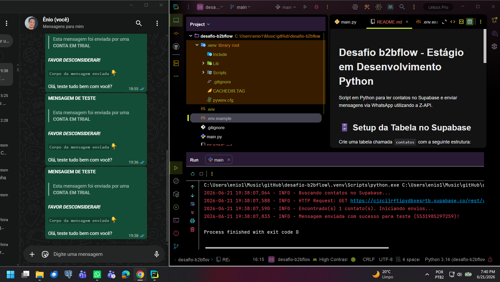

# Desafio b2bflow - Estágio em Desenvolvimento Python

Script em Python para ler contatos no Supabase e enviar mensagens via WhatsApp utilizando a Z-API.

## 🗄️ Setup da Tabela no Supabase
Crie uma tabela chamada `contatos` com a seguinte estrutura:
* `id` (int8, Primary Key)
* `nome_contato` (text)
* `telefone` (text) - Formato: DDI + DDD + Número (ex: 5531999999999)

## 🔐 Variáveis de Ambiente (.env)
Crie um arquivo `.env` na raiz do projeto baseado no `.env.example`. Preencha com suas credenciais do Supabase e Z-API.

## Como rodar o projeto

Siga o passo a passo abaixo no seu terminal para clonar o repositório, configurar o ambiente virtual, instalar as dependências e executar o script:

```bash
# 1. Clone o repositório e acesse a pasta
git clone [https://github.com/eniomartinst/desafio-b2bflow.git](https://github.com/eniomartinst/desafio-b2bflow.git)
cd desafio-b2bflow

# 2. Crie e ative um ambiente virtual (Windows)
python -m venv .venv
.venv\Scripts\activate

# 3. Instale as dependências
pip install -r requirements.txt

# 4. Execute o script principal
python main.py
```

---

## 👨‍💻 Autor
**Ênio Martins**
* GitHub: [https://github.com/eniomartinst](https://github.com/eniomartinst)

---

## Evidência do desafio realizado e rodando
